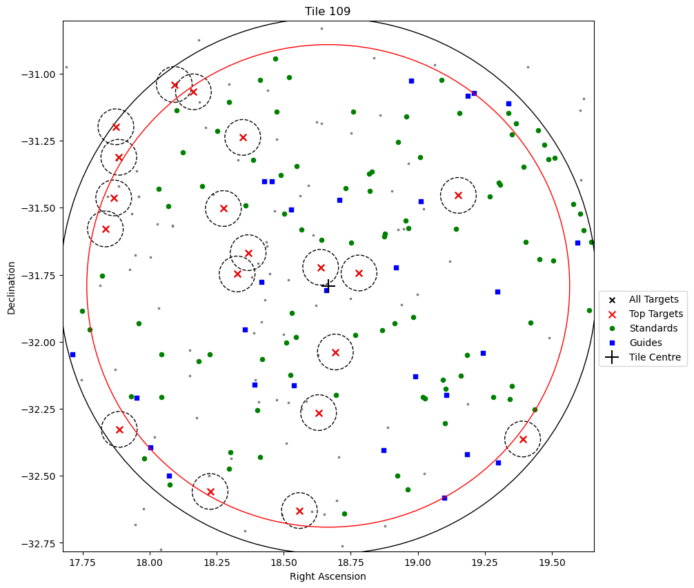
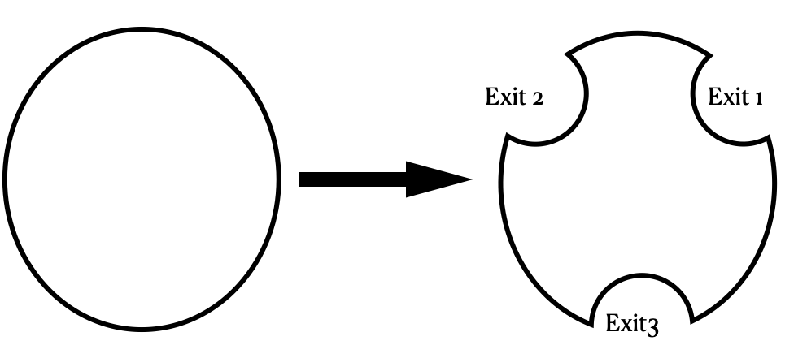

# Notes for future improvements...

There are a few places that the tiling code will need to be modified/improved in the future. Below explains briefly what will need to be updated.

## Galaxies which have been observed but not reduced

At the moment, the code finds which galaxies which have been observed and reduces their `N_observations_to_complete` counter by 1. Ideally, however, there needs to be two checks here: galaxies which have been observed _and not yet reduced_ as well as galaxies which have been reduced and passed the quality control (QC) process. In other words, the tiling code at the moment can't account for galaxies which have been observed but which fail QC and need to be re-observed.

When the data reduction pipeline and QC process is mature and stable, I'd recommend making a new table in the Hector Observing Database which tracks the galaxies which have passed the QC checks. This needs a bit of thought, but I think that this "QC" column needs to have three options:

* QC passed- this galaxy is done and shouldn't be re-tiled.
* QC failed- this galaxy needs to be tiled again
* QC pending- this galaxy hasn't been reduced/checked yet, in which case *it also shouldn't be re-tiled*.

You'll then be able to update the start of `workflow/scripts/remove_observed_galaxies.py` to only remove only galaxies which have passed QC or for which QC is still pending. Galaxies which have been observed and which failed QC should be put back into the catalogues.

## A small bug with the plotting

Currently, the plots which the code make are incorrect for fields at low declination. Below is an example:



You can see that some of the galaxies have been placed outside of the red exclusion radius. **This is only a bug with the plotting, not with the files the code makes**.

There's a simple $\cos(\delta)$ factor which needs to be included in the plotting. You can see that this is the case because the plot has a perfect circle for the field-of-view. In reality, the circular metal Hector plate actually covers an elliptical region in RA and DEC on the surface of the celestial sphere when you get to low declinations. 

The place to fix this would be in the `plot_tile` function of the [`tiling_functions.py`](https://github.com/samvaughan/Hector-Observations-Pipeline/blob/master/hop/tiling/tiling_functions.py) file. Line 1072 to 1078 plot the outer field radius- these should be changed to ellipses, with a semiminor axis of 1 degree and a semimajor axis scaled by the declination, i.e. of $1/\cos(\delta)$.

## A new tile cutout shape

The first step of the tiling works by placing a "Hector Field of View" down on the sky and seeing which targets fall within its outer edge. One issue caused by this is that galaxies can end up very close to the three exit gaps on the plate. In an ideal world, I think the "Field of View" used in the first step should have little cutouts around the positions where these exit gaps are.



There might be some headaches implementing this in the code: the current method in [`tiling_functions.py`](https://github.com/samvaughan/Hector-Observations-Pipeline/blob/master/hop/tiling/tiling_functions.py) does the following check:

```python
mask = np.sqrt((x - xcen) ** 2 * cos_dec_correction**2 + (y - ycen) ** 2) < radius
```

whereas the new mask would mean you'd have to have some more complicated logic about subtracting the three new cutouts. You'd also need to find the optimum radii for these three cutouts and find how this impacts the tiling efficiency (my guess- probably very little).

